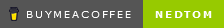

### Hi there 👋

Om my profile i wil share some code and opensource projects.

🌱 I’m currently learning:
- Gnome Extentions.
- Rust Programing language.
- Better Javascript and Gjs.
- Typescript
- and some random stuff.

👯 I’m looking to collaborate on small project's that need some non crucial help.

⚡ fact: Can be grumpy when he's feeling responsible and has to much hay on it fork.

🤔 I’m looking for help with getting stuff done.

Coding languages i know a bit of:
- html
- css/scss
- Javascript
- php
- Rust
- Python
- C#

If you like what I'm doing pleas consider to buy me a Cappuccino, the stuff that keeps me going.

<!--
**Ned-Tom/Ned-Tom** is a ✨ _special_ ✨ repository because its `README.md` (this file) appears on your GitHub profile.

Here are some ideas to get you started:

- 🔭 I’m currently working on ...
- 🌱 I’m currently learning ...
- 👯 I’m looking to collaborate on ...
- 🤔 I’m looking for help with ...
- 💬 Ask me about ...
- 📫 How to reach me: ...
- 😄 Pronouns: ...
- ⚡ Fun fact: ...
-->
